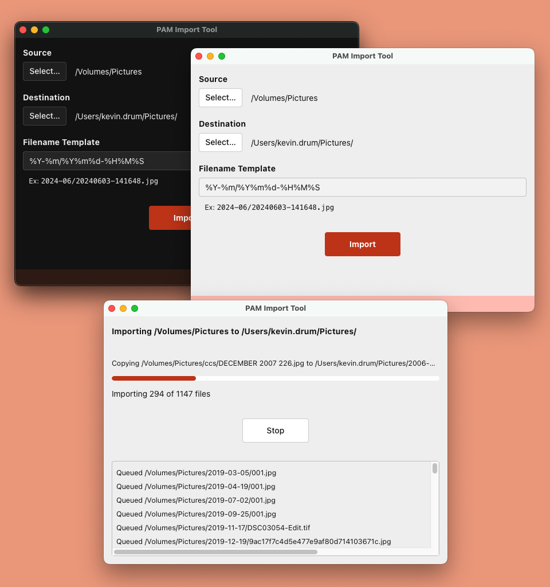

# PAM (Photo And Movie) Import Tool

PAM Import Tool is a cross-platform desktop app developed with
[Tauri](https://tauri.app/) / [Rust](https://www.rust-lang.org/) /
[Svelte](https://svelte.dev/) that provides a no-frills solution for copying and
renaming photo and video files.

I made this for my mom, so I have not included many configuration options. I
have only tested it on MacOS Sonoma 14.5 and Windows 11.

## How it works

Upon opening, the tool will set the default **Source** directory to either: the
_first_ removable drive it finds, or if there are no removable drives, the
_last_ disk/volume that is present.

The default **Filename Template** creates subdirectories based on the year and
month (e.g. "2024-06"). See
[the chrono docs for the syntax](https://docs.rs/chrono/latest/chrono/format/strftime/index.html).

The date is pulled from the `DateTimeOriginal` EXIF tag if present (images
only). Otherwise, it uses either the file creation date or last-modified date,
whichever is older.

The tool currently scans for these extensions:

- `jpg`
- `jpeg`
- `png`
- `tif`
- `tiff`
- `mp4`
- `mov`
- `avi`
- `mpg`
- `wmv`

During import, if a file already exists with the same name and file size, then
that file is skipped. However, if the name exists, but the file size is
different, then a counter is appended to the filename (e.g.
`20240603-120101_1.jpg`).
